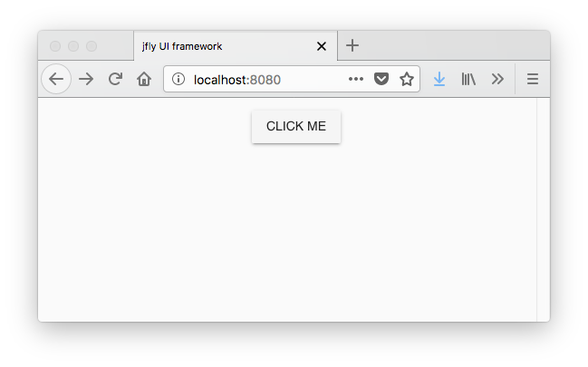
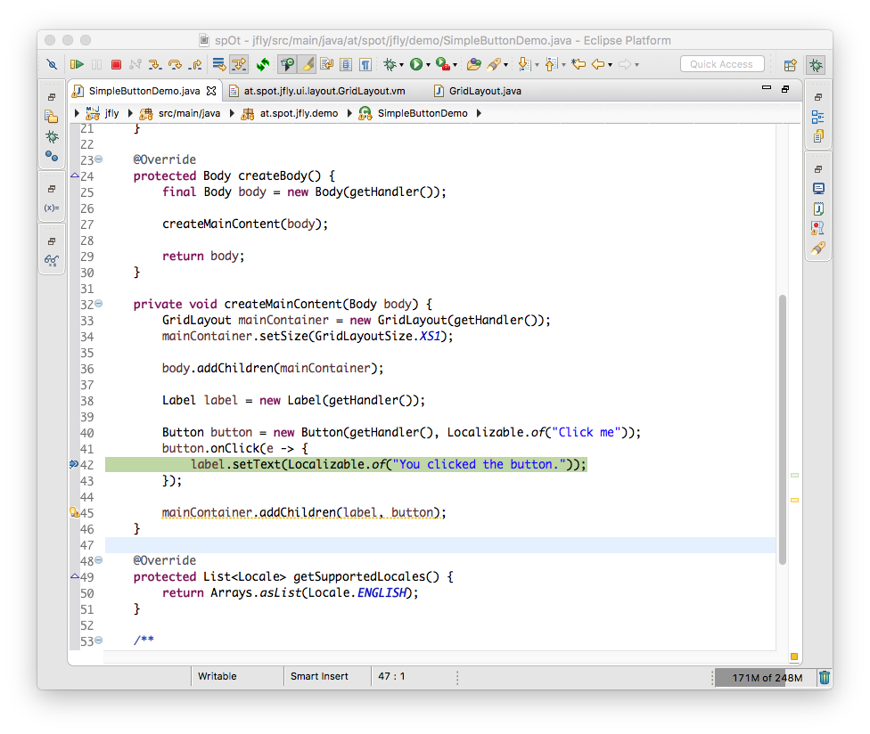
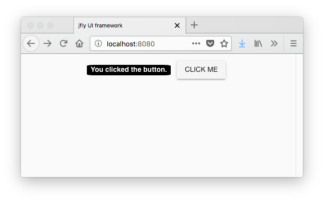

# jfly - a slick and modern java web UI framework
## What is it?
The idea behind jfly is to provide an easy to use and modern Java web UI framework. But why reinvent the wheel all the time? Aren't there alot of Java frameworks already out there, like Vaadin?
Frameworks like Vaadin ship their own UI components or do some other weird transpilation/comilation magic to allow you to code in Java (like GWT). All of them have their pitfalls and most struggle with performance problems.
But there are also plenty of good javascript based UI frameworks out there. Why not utilize those frameworks an wrap them in a nice Java API?

That's how these requirements came together:
* Provide a thin java API wrapper around vue and vuetifyjs
* Provide efficient means to store and retrieve UI state in the backend
* Push data from the backend to individual clients (and also broadcast messages)
* Easy to customize existing UI components
* Easy to write or create custom UI components

## How does it work?
So lets come to the fun part ...

This little demo application spins up a webserver on port 8080:
```
public class SimpleButtonDemo extends ViewHandler {
	@Override
	protected Head createHeader() {
		return new Head(getHandler()).setTitle("jfly UI framework");
	}

	@Override
	protected Body createBody() {
		final Body body = new Body(getHandler());

		createMainContent(body);

		return body;
	}

	private void createMainContent(Body body) {
		GridLayout mainContainer = new GridLayout(getHandler());
		mainContainer.setSize(GridLayoutSize.XS1);

		body.addChildren(mainContainer);

		Label label = new Label(getHandler());

		Button button = new Button(getHandler(), Localizable.of("Click me"));
		button.onClick(e -> {
			label.setText(Localizable.of("You clicked the button."));
		});

		mainContainer.addChildren(label, button);
	}

	@Override
	protected List<Locale> getSupportedLocales() {
		return Arrays.asList(Locale.ENGLISH);
	}

	/**
	 * Entry point for demo application
	 */
	public static void main(final String[] args) {
		final Server server = new Server(8080);
		server.registerViewHandler("/", SimpleButtonDemo.class);
		server.start();
	}
```

When you browse to http://localhost:8080 you'll see this:


So far so good. You now probably ask yourself, what's so special about it?

The UI is initially rendered as HTML, but all other DOM manipulation and event handling is done using a websocket connection to the java backend.
As all state changes are handled there this allows you to directly debug your event handlers in Java:


Within an event handler you can:
* Create or remove components
* Change the state of any component in scope
* Do whatever business logic you might need

The state changes are communicated back to the browser asynchronously and rendered by the vue-based frontend.

So after you hit run on your breakpoint you get this in your browser:


If you are not happy with the looks of the label you can do:
1. Configure the component using the Java API (e.g. set style classes)
2. Override the the HTML template
3. Subclass the component and do whatever you want

Option 1 and 3 are pretty straig forward. But option 2 does need a few more words.

The template renderer looks for a velocity template with the fully-qualified name of the component, in our case `at.spot.jfly.ui.display.Label`:
```
<span
	uuid="${_uuid}" $!events
	:class="${_state}.styleClasses" class="label" 
	v-bind="${_state}.attributes">
	
	{{localize(${_state}.text)}}
</span>
```

You can alter the HTML as you like, except for the `uuid` attribute. It is necessary to identify the component on the  backend. The `${_state}` represents a javascript object (within vue's data object). It holds the component state and the component reacts on changes of this state object automatically.

## Future work
Right now I would consider this framework in alpha status. There are only a handful of components implemented. But it's pretty stable right now.

